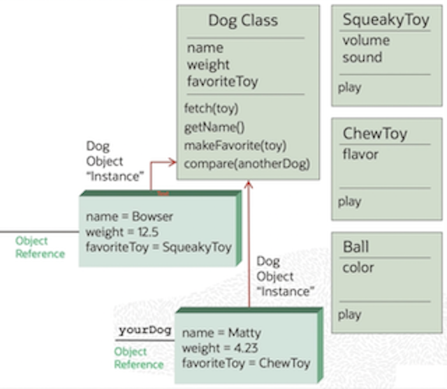

## Objectives

- Define an object, class, attribute, method and message
- Explain what it means to create an object-oriented application.
- [Squeak/SmallTalk](https://squeak.org/)

### Benefits 

- Easier to maintain
- Easier to enhance and extend
- Single place of coding
- Minimizes side effects
- Mimics real life, so developers can leverage their knowledge

### Considerations and possible downsides

- Have to code more initially - not really a benefit on new development - more benefit on maintainance
- More verbose
- Memory allocation, garbage collection, slight performance impact over compiled code

### What is this OO stuff, anyway?

- OO is about simulating the real world in a computer
- In the real world, we interact with objects every day without thinking about how they work or why 
- We tell someone or something to do something and it does it (mostly)
- What do we know that a Dog can do or know? 
    - Behaviors: Eat, sleep, speak, chase cars, walk ...
    - Internal States: Name, weight, favoriteToy ...

### Solve a problem using objects

- Problem Domain: Have a dog fetch and play with a toy
- The owner asks the dog to fetch the toy. After the dog has fetched the toy, the dog plays with the toy. This scenario is called a Use Case. It is where object-oriented starts. A Use Case describes the objects that will be used to create the application. It also describes what messages(behaviors) an object understands. What things do you typically work with in this use case? In the Dog Domain, we work with;
    - Dogs, owners, dog toys

- 
- We use a Class to specify the design of our objects
- A Object is a specific instance of a Class at run time

### What is a Class?

- It is a template for creating new objects
    - Name of the class, attributes and their types, messages they understand, their arguments, return types and the code to implement them

### What is an Object?

- At run time, an object is created in memory
- Memory is allocated for its attributes
- Each object has unique object reference, a pointer to that object in memory
- Each object has a pointer to its class definition

### What is next?

- Abstraction
- Encapsulation
- Inheritance 
- Polymorphism